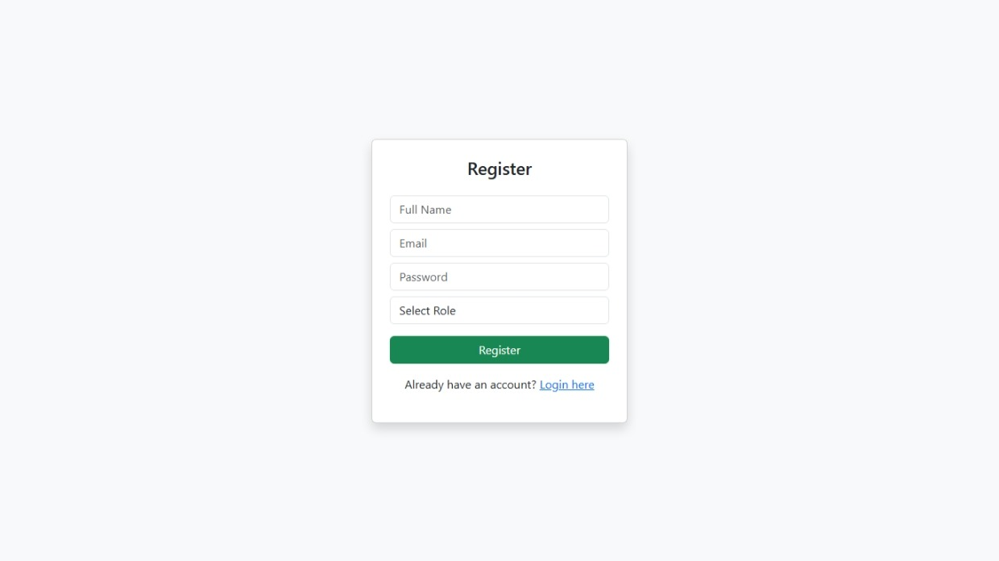
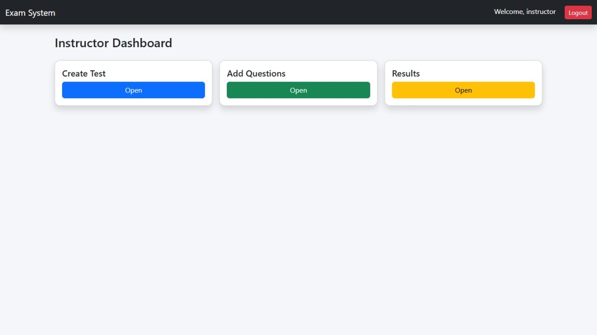
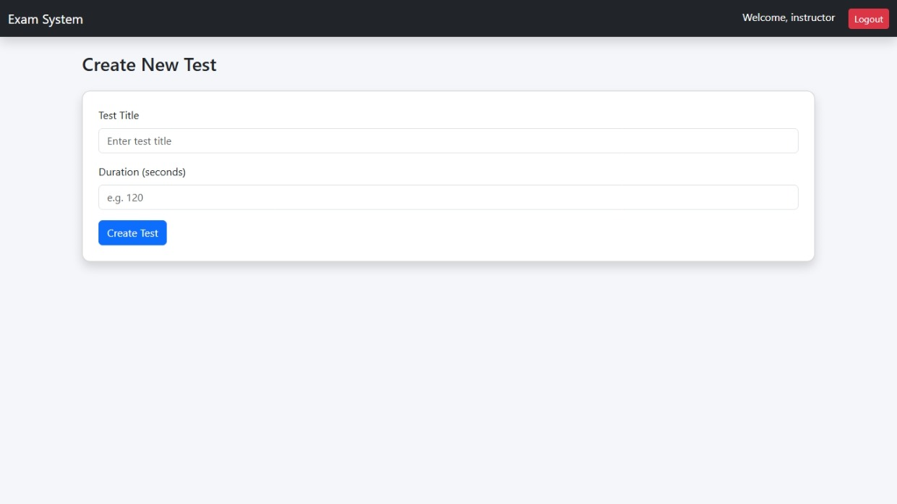
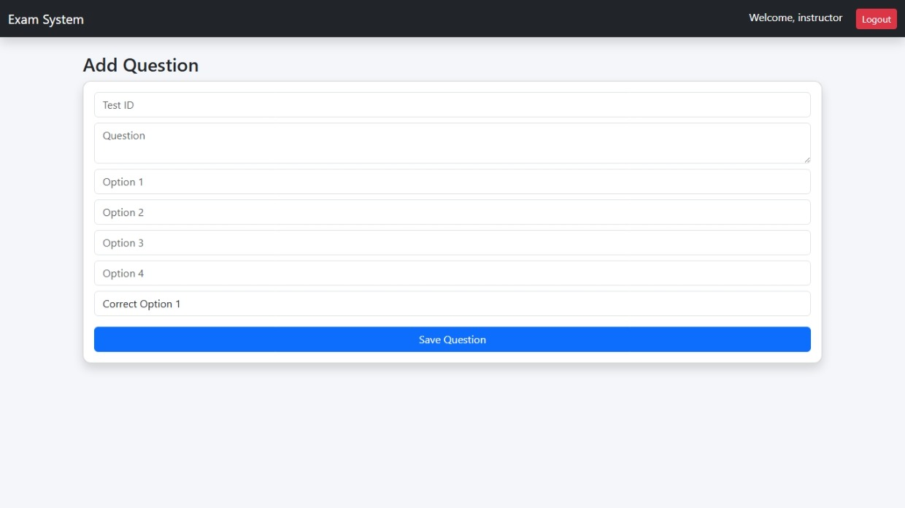
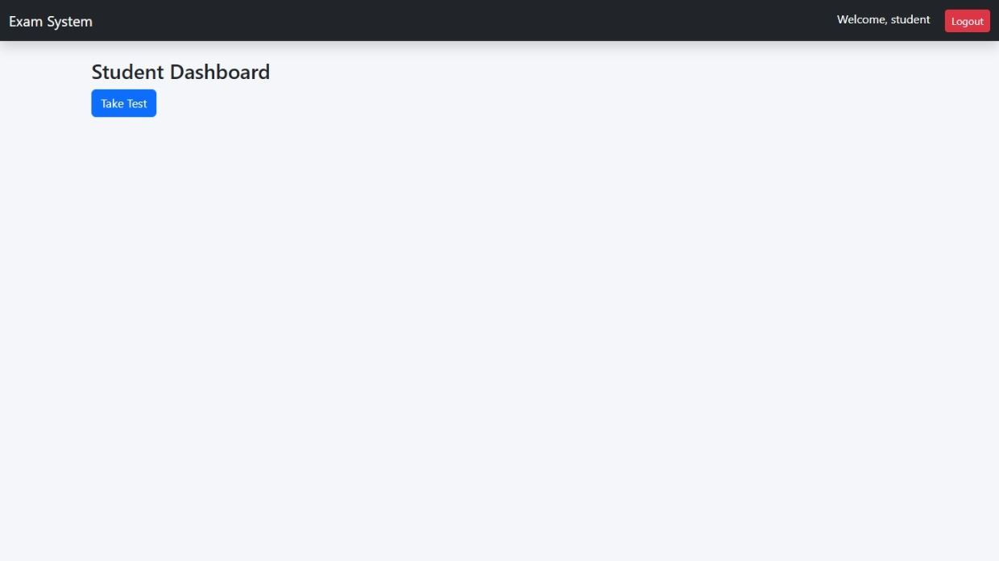
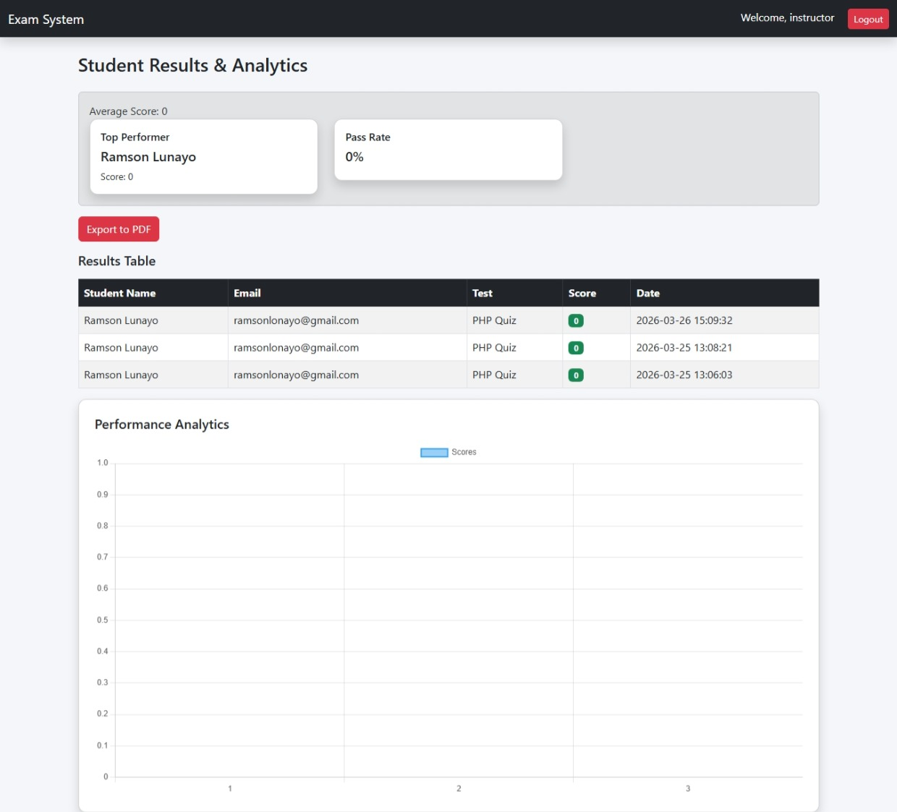

# 🎓 Online Examination System

A web-based Online Examination System developed using PHP and MySQL that allows instructors to create and manage exams while students can take tests online with automatic grading and real-time results.

---

## 🚀 Features

### 👨‍🏫 Instructor

* Create and manage tests
* Add and manage questions (MCQs)
* View student results
* Access performance analytics (average score, pass rate, top performer)
* Export results to PDF

### 👨‍🎓 Student

* Register and login securely
* Take timed exams
* Automatic submission when time expires
* View results instantly after submission

---

## 🧠 System Functionalities

* ✅ Client-Server architecture
* ✅ Session-based authentication (Instructor & Student roles)
* ✅ Timer and auto-submit feature
* ✅ Automatic grading system
* ✅ Anti-cheating mechanisms (basic)
* ✅ Performance analytics dashboard
* ✅ PDF report generation

---

## 🛠️ Tech Stack

* **Frontend:** HTML, CSS, Bootstrap
* **Backend:** PHP
* **Database:** MySQL
* **Server:** XAMPP (Apache & MySQL)
* **Library:** FPDF (for PDF export)

---

## 📁 Project Structure

```
online-exam-system/
│
├── auth/               # Login & Registration
├── instructor/         # Instructor dashboard & tools
├── student/            # Student interface
├── config/             # Database connection
├── includes/           # Header & Footer
├── assets/             # CSS, JS, Images
├── fpdf/               # PDF library
├── index.php           # Entry point
```

---

## ⚙️ Installation Guide (Localhost)

### 1️⃣ Clone Repository

```
git clone https://github.com/your-username/online-exam-system.git
```

---

### 2️⃣ Move Project

Copy the folder to:

```
C:\xampp\htdocs\
```

---

### 3️⃣ Start Server

* Start **Apache**
* Start **MySQL**

---

### 4️⃣ Setup Database

Open:

```
http://localhost/phpmyadmin
```

Create database:

```
exam_system
```

Import or run SQL:

```sql
CREATE TABLE users (
    id INT AUTO_INCREMENT PRIMARY KEY,
    name VARCHAR(100),
    email VARCHAR(100),
    password VARCHAR(255),
    role ENUM('student','instructor')
);

CREATE TABLE tests (
    id INT AUTO_INCREMENT PRIMARY KEY,
    title VARCHAR(255),
    duration INT,
    created_by INT
);

CREATE TABLE questions (
    id INT AUTO_INCREMENT PRIMARY KEY,
    test_id INT,
    question TEXT
);

CREATE TABLE options (
    id INT AUTO_INCREMENT PRIMARY KEY,
    question_id INT,
    option_text VARCHAR(255),
    is_correct BOOLEAN
);

CREATE TABLE results (
    id INT AUTO_INCREMENT PRIMARY KEY,
    student_id INT,
    test_id INT,
    score INT,
    submitted_at TIMESTAMP DEFAULT CURRENT_TIMESTAMP
);
```

---

### 5️⃣ Configure Database

Edit:

```
config/db.php
```

```php
$conn = new mysqli("localhost", "root", "", "exam_system");
```

---

### 6️⃣ Run the Application

Open:

```
http://localhost/online-exam-system
```

---

## 📊 Features Implemented

* ✔ CRUD operations for tests and questions
* ✔ Secure authentication system
* ✔ Timer-controlled exams
* ✔ Auto grading logic
* ✔ Results visualization
* ✔ Analytics (average score, pass rate)
* ✔ PDF export using FPDF

---

## 🔐 Security Features

* Password hashing
* Session management
* Input validation
* Prevention of multiple submissions

---

## 🌍 Deployment

The system can be deployed on free hosting platforms like:

* InfinityFree
* 000WebHost

---

## 📸 Screenshots


### 🔐 Login Page


---

### 📝 Register Page



---

### 📊 Instructor Dashboard



---

### ➕ Create Test



---

### ❓ Add Questions



---

### 🧪 Take Test



---

### 📈 Results & Analytics



---

### 📄 PDF Export


---

## 👨‍💻 Author

**Ramson Lonayo**
Software Engineering Student – Kirinyaga University

---

## 📜 License

This project is for educational purposes.
